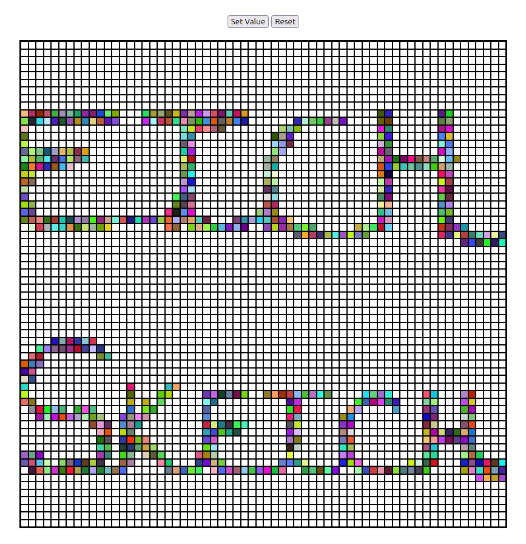

# Etch-a-sketch

A browser-based Etch-a-sketch built with HTML, CSS ans Javascript.

## Live Demo

🔗 [Draw yourself!](https://euflauzinoandre.github.io/etch-a-sketch/)

## Features

- interactive drawing screen
- Randorm colors
- DOM manipulation with JavaScript

## Technologies Used

- HTML5
- CSS3
- JavaScript (Vanilla JS)

## What I Learned

This project helped me practice:

- DOM manipulation
- ForEach
- Grid CSS
- CSS Random Colors

## Challenges

The two biggest challenges were creating the grid elements using the CSS grid property and randomizing the colors when hovering the pointer over each item.

## Future Improvements

- Think in more options to draw
- Add brightness and opacity for CSS colors
- Allow user to save the screen
- Change the theme of browser

## Screenshots

## Acknowledgements

This project was created as part of The Odin Project curriculum.

https://www.theodinproject.com